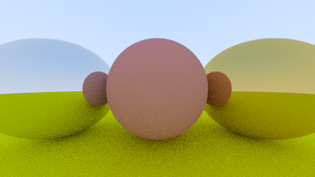
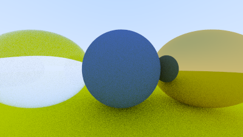
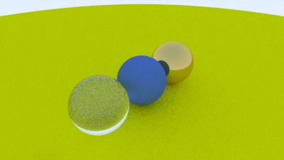
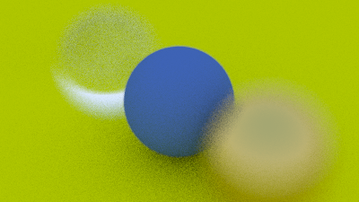
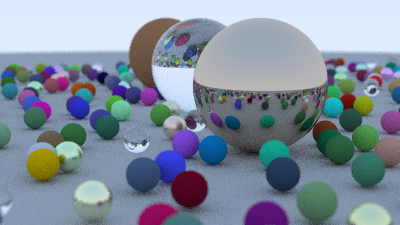

## Ray Tracing in One Weekend
Learning to implement a ray tracer by following along with
[_Ray Tracing in One Weekend_](https://raytracing.github.io/books/RayTracingInOneWeekend.html)

I won't be doing this in one weekend but over a couple of weeks/months when I get time.

# Examples
I started taking screen shot examples as I went once I got about half way through.
I started tracking render times in Debug builds when I added the camera in #3.

### 1. Creating a metallic material

### 2. Creating a dielectric material - eg: a glass ball

## 3. Added positionable camera with controllable FOV 
Render Time: ~9.8s with no optimizations

## 4. Added defocus blur with controllable aperture size
Render Time: ~12.2s with no optimizations

## 5. Rendered the final image from the book
Render Time: ~415.3s (6m 55s) with no optimizations

## Notes on Debug vs Release
I'm compiling in Visual Studio on Windows.
For some reason I'm required to build in Debug as when building with release optimizations (Release x64 in visual studio) the image gets corrupted and is un-openable. 
It doesn't seem to write out all the pixels which leads me to believe some optimization is blowing certain loops away?
Not sure but should be investigated as it would greatly improve render times.